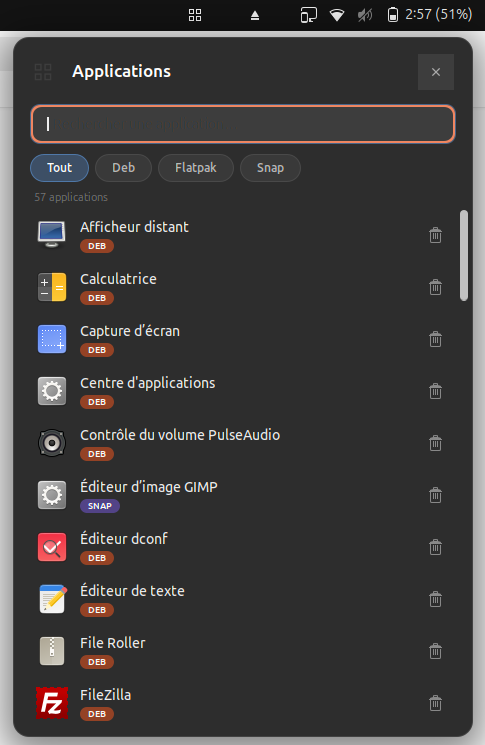

# App Manager Remover — GNOME Shell Extension

A unified application manager for GNOME Shell that lists all user-installed applications — **Flatpak**, **Snap**, and **Deb** — in a single searchable panel with one-click uninstall.

Built for GNOME Shell **45 / 46 / 47 / 48**.

---

## Features

- **Unified app list** — All user applications from all packaging formats, sorted alphabetically.
- **Source badges** — Each app shows a colored badge: 🟠 DEB, 🟢 FLATPAK, 🟣 SNAP.
- **Real-time search** — Filter apps by name as you type.
- **Source filters** — Toggle between All / Deb / Flatpak / Snap.
- **One-click uninstall** — Confirmation dialog, then password prompt via `pkexec`.
- **System protection** — Multi-layer filtering hides system components; essential deb packages cannot be removed.

---

## Screenshots



---

## Installation

### From extensions.gnome.org

Search for **App Manager Remover** on [extensions.gnome.org](https://extensions.gnome.org/) and toggle it on.

### From the zip file

```bash
gnome-extensions install app-manager-remover@lokoyote.eu.zip
```

Then restart GNOME Shell (log out / log in on Wayland, or `Alt+F2` → `r` on X11) and enable:

```bash
gnome-extensions enable app-manager-remover@lokoyote.eu
```

### Manual installation

Copy these three files into the extension directory:

```
~/.local/share/gnome-shell/extensions/app-manager-remover@lokoyote.eu/
├── metadata.json
├── extension.js
└── stylesheet.css
```

Then enable and restart:

```bash
gnome-extensions enable app-manager-remover@lokoyote.eu
```

---

## Uninstallation

```bash
gnome-extensions disable app-manager-remover@lokoyote.eu
rm -rf ~/.local/share/gnome-shell/extensions/app-manager-remover@lokoyote.eu
```

---

## How it works

The extension queries all `.desktop` entries via `Shell.AppSystem.get_installed()`, then filters them:

1. **`should_show()`** — Same check as GNOME's own launcher (NoDisplay, Hidden, OnlyShowIn, valid Exec).
2. **XDG categories** — Excludes entries with only system categories (Settings, Core…) but keeps apps that also have user categories (e.g. GIMP with "Graphics;System").
3. **Desktop-ID patterns** — Rejects known system prefixes (`org.freedesktop.*`, `org.gnome.shell.*`…) and infixes (`update-manager`, `ibus-setup`…).
4. **Flatpak** — `flatpak list --app` already excludes runtimes and SDKs.
5. **Snap** — Filters out base/core/runtime snaps by name and pattern.
6. **Deb** — At uninstall time, checks `dpkg-query` Priority, Essential, and Section fields. Protected packages are blocked.

### Uninstall commands

| Source | Command | Auth |
|--------|---------|------|
| Flatpak | `flatpak uninstall -y <app-id>` | None |
| Snap | `pkexec snap remove <name>` | Password |
| Deb | `pkexec apt remove -y <pkg>` | Password |

Uses `apt remove` (not `purge`) — config files are preserved.

---

## Requirements

- GNOME Shell 45, 46, 47, or 48
- Flatpak and/or Snapd (optional — apps are listed only if the tool is installed)
- PolicyKit / pkexec (pre-installed on Ubuntu and Fedora)

---

## License

GPL-3.0-or-later — see [LICENSE](LICENSE).
